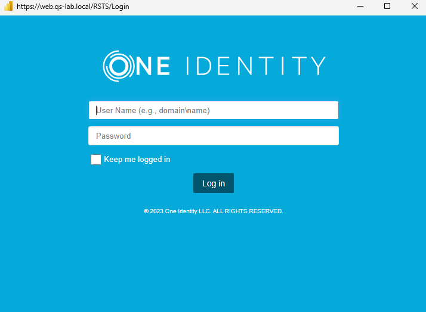

**One Identity open source projects are supported through [One Identity GitHub issues](https://github.com/OneIdentity/IdentityManager.PowerBI/issues) and the [One Identity Community](https://www.oneidentity.com/community/). This includes all scripts, plugins, SDKs, modules, code snippets or other solutions. For assistance with any One Identity GitHub project, please raise a new Issue on the [One Identity GitHub project](https://github.com/OneIdentity/IdentityManager.PowerBI/issues) page. You may also visit the [One Identity Community](https://www.oneidentity.com/community/) to ask questions.  Requests for assistance made through official One Identity Support will be referred back to GitHub and the One Identity Community forums where those requests can benefit all users.**

# Power BI Custom Connector for One Identity Manager

<!-- TABLE OF CONTENTS -->

  
<h2 style="display: inline-block">Table of Contents</h2>

  <ol>
    <li><a href="#about-the-project">About the project</a></li>
    <li><a href="#a-simple-report-preview">A simple report preview</a></li>    
    <li><a href="#development-quickstart">Development quickstart</a></li>    
    <li><a href="#usage">Usage</a></li>
    <li><a href="#contributing">Contributing</a></li>
    <li><a href="#pitfalls">Pitfalls</a></li>
    <li><a href="#license">License</a></li>
    <li><a href="#resources">Resources</a></li>
  </ol>

<!-- ABOUT THE PROJECT -->
## About the project

This is a Power BI Custom Connector for [One Identity' Identity Manager](https://www.oneidentity.com/products/identity-manager/).

Historically, there has never been a simple, centralized and widely used reporting solution for customers. PowerBI is the first solution to reach into customer organizations, and there is a trend for customers to use PowerBI as their central reporting engine. Even though One Identity Manager is based on a SQL Server database and PowerBI provides a SQL Server data source, with the rise of One Identity Manager OnDemand and more customers using SQL Managed Instance in Azure, SQL is not necessarily a protocol that can be used.

The Power BI connector for One Identity Manager is designed to replace the need for direct SQL access to a One Identity Manager database. Instead, it uses the application server's REST API to connect to a One Identity Manager database. The benefits are:
  - using https as a protocol instead of SQL
  - by requiring One Identity Manager authentication, the permissions layer in One Identity Manager ensures that users see only the information they are authorized to see

<!-- PREVIEW -->
## A simple report preview

Just one sample demo report by using the Power BI Custom Connector:

<!-- Development QUICKSTART -->
## Development quickstart

1. Install [Microsoft Visual Studio 2019](https://visualstudio.microsoft.com/vs/)
2. Install the [Power Query SDK](https://aka.ms/powerquerysdk) from the Visual Studio Marketplace
3. Clone [this project](https://github.com/OneIdentity/IdentityManager.PowerBI)
4. Compile the project
5. Copy the resulting `IdentityManager.mez` file over to the machine running Microsoft Power BI Desktop
6. If not already done, create a folder structure as `Power BI Desktop\Custom Connectors` under your documents directory (`C:\Users\<Your-Profile-Name>\Documents\`) and place the `IdentityManager.mez` file there
7. Restart [Power BI Desktop](https://powerbi.microsoft.com/desktop)

<!-- USAGE EXAMPLES -->
## Usage

Obtain a `IdentityManager.mez` by building it as described in the [Development quickstart](#development-quickstart) or download it from the [latest release](https://github.com/OneIdentity/IdentityManager.PowerBI/releases/latest).
Copy the file to `C:\Users\<Your-Profile-Name>\Documents\Power BI Desktop\Custom Connectors`.

Once the file `IdentityManager.mez` is in place, you can load the Custom Connector in [Power BI Desktop](https://powerbi.microsoft.com/desktop):

Because the Power BI Custom Connector for One Identity Manager is unsigned, you receive an error like this:

When the connector is loaded you have to specify the URL for the Application Server and the URL of the Redistributable Secure Token Server (RSTS):

You will need to log in the first time you try to make a connection:

The Secure Token Server uses OAuth2, so we just log in to a domain:

After successfully authenticating and logging in, we see the following dialog. The Identity Manager Power BI Custom Connector uses OpenAPI to access all Application Server functions that can return data. All of these functions can be used in PowerBI queries:

<!-- CONTRIBUTING -->
## Contributing

Contributions are what make the open source community such an amazing place to be learn, inspire, and create. Any contributions you make are **highly appreciated**.

1. Fork [this project](https://github.com/OneIdentity/IdentityManager.PowerBI)
2. Create your Feature Branch (`git checkout -b feature/AmazingFeature`)
3. Commit your Changes (`git commit -m 'Add some AmazingFeature'`)
4. Push to the Branch (`git push origin feature/AmazingFeature`)
5. Open a Pull Request

<!-- PITFALLS -->
## Pitfalls

* **This will only work with Identity Manager 8.2 and greater**. Any prior release will not work.
* You must allow non-certified custom connectors in Power BI Desktop as shown [here](https://learn.microsoft.com/en-us/power-bi/connect-data/desktop-connector-extensibility#data-extension-security)
* You must assign an OAuth 2.0/OpenID connect application to the application server web app as shown [here](https://support.oneidentity.com/de-de/technical-documents/identity-manager/9.1/authorization-and-authentication-guide/28#TOPIC-1872879)
* You must assign the feature group `Enables access to the REST API in the application server.` to the login account used in the Custom Connector during the OAuth2 login process.

<!-- LICENSE -->
## License

Distributed under the One Identity - Open Source License. See [LICENSE](LICENSE) for more information.

<!-- RESOURCES -->
## Resources

Custom connectors are written with the functional Power Query M formula language. A language reference can be found here [https://docs.microsoft.com/en-us/powerquery-m/](https://docs.microsoft.com/en-us/powerquery-m/)