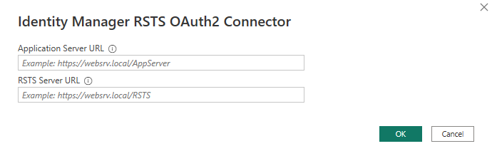
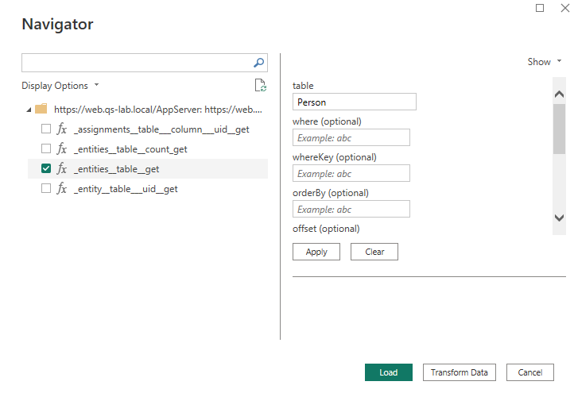

**One Identity open source projects are supported through [One Identity GitHub issues](https://github.com/OneIdentity/IdentityManager.PowerBI/issues) and the [One Identity Community](https://www.oneidentity.com/community/). This includes all scripts, plugins, SDKs, modules, code snippets or other solutions. For assistance with any One Identity GitHub project, please raise a new Issue on the [One Identity GitHub project](https://github.com/OneIdentity/IdentityManager.PowerBI/issues) page. You may also visit the [One Identity Community](https://www.oneidentity.com/community/) to ask questions.  Requests for assistance made through official One Identity Support will be referred back to GitHub and the One Identity Community forums where those requests can benefit all users.**

# Power BI Custom Connector for One Identity Manager

<!-- TABLE OF CONTENTS -->

  
<h2 style="display: inline-block">Table of Contents</h2>

  <ol>
    <li><a href="#about-the-project">About the project</a></li>
    <li><a href="#quickstart">Quickstart</a></li>    
    <li><a href="#usage">Usage</a></li>
    <li><a href="#contributing">Contributing</a></li>
    <li><a href="#pitfalls">Pitfalls</a></li>
    <li><a href="#license">License</a></li>
    <li><a href="#resources">Resources</a></li>
  </ol>

<!-- ABOUT THE PROJECT -->
## About the project

This is a simple Power BI Custom Connector for [One Identity' Identity Manager](https://www.oneidentity.com/products/identity-manager/).

Historically there never was a simple, centralized and widely used reporting solution available for customers. PowerBI is the first solution that gets a reach into customer organization and there is a trend that customers are going to use PowerBI as a central reporting engine. Even if One Identity Manager is based on a SQL Server database and PowerBI provding a SQL Server data source, with the raise of One Identity Manager OnDemand as well as more and more customer using SQL Manged Instance in Azure, SQL is not necessarily a protocol that can be used.

The Power BI connector for One Identity Manager is built for replacing the requirement of direct SQL access to a One Identity Manager database. Instead the ReST API of the Application Server is used for connecting to a One Identity Manager. The benefits are
  - using https as a protocol instead of SQL
  - by requiring a One Identity Manager authentication the permissions layer in One Identity Manager ensuring that users only get information they are supposed to see.

Once the custom connector reaches it stable status, One Identity will be seeking certification by Microsoft.

<!-- GETTING STARTED -->
## Quickstart

1. Install [Microsoft Visual Studio 2019](https://visualstudio.microsoft.com/vs/)
2. Install the [Power Query SDK](https://aka.ms/powerquerysdk) from the Visual Studio Marketplace
3. Clone [this project](https://github.com/OneIdentity/IdentityManager.PowerBI)
4. Modify the values for `token_uri`, `authorize_uri` and `logout_uri` in file [IdentityManager.pq](https://github.com/OneIdentity/IdentityManager.PowerBI/blob/master/src/IdentityManager/IdentityManager.pq) to match your installation of the Secure Token Server (STS) which is part of the [One Identity' Identity Manager](https://www.oneidentity.com/products/identity-manager/)
5. Compile the project
6. Copy the resulting `IdentityManager.mez` file over to the machine running Microsoft Power BI Desktop
7. If not already done, create a folder structure as `Microsoft Power BI Desktop\Custom Connectors` under your documents directory (`C:\Users\<Your-Profile-Name>\Documents\`) and place the `IdentityManager.mez` file there
8. Restart [Power BI Desktop](https://powerbi.microsoft.com/en-us/)

<!-- USAGE EXAMPLES -->
## Usage

Once the file `IdentityManager.mez` is in place you can load the custom data connector:

As the Power BI Custom Connector for One Identity Manager is unsigned you will receive an error like this:

When the connector is loaded you have to specify the URL for the Application Server and the table name you would like to query:

At the first try you have to sign in

The Secure Token Server is using OAuth2, therefore we just log into an domain

After successful authentication and login we are able to retrieve a data preview

<!-- CONTRIBUTING -->
## Contributing

Contributions are what make the open source community such an amazing place to be learn, inspire, and create. Any contributions you make are **highly appreciated**.

1. Fork [this project](https://github.com/OneIdentity/IdentityManager.PowerBI)
2. Create your Feature Branch (`git checkout -b feature/AmazingFeature`)
3. Commit your Changes (`git commit -m 'Add some AmazingFeature'`)
4. Push to the Branch (`git push origin feature/AmazingFeature`)
5. Open a Pull Request

<!-- PITFALLS -->
## Pitfalls

* **This will only work with the upcoming Identiy Manager 8.2 release**. Any prior release will not work.
* You have to assign an OAuth 2.0/OpenID connect application to the application server web app.
* You have to assign the feature group `Enables access to the REST API in the application server.` to your final login account.

<!-- LICENSE -->
## License

Distributed under the One Identity - Open Source License. See [LICENSE](LICENSE) for more information.

<!-- RESOURCES -->
## Resources

Custom data connectors are written with the functional Power Query M formula language. A language reference can be found here [https://docs.microsoft.com/en-us/powerquery-m/](https://docs.microsoft.com/en-us/powerquery-m/)
