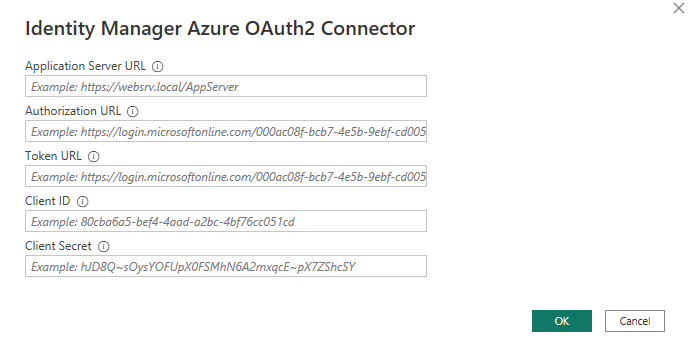

# Setting up Azure OAuth2 authentication for One Identity Manager and Power BI custom connector

  
<h2 style="display: inline-block">Table of Contents</h2>

  <ol>
    <li><a href="#setting-up-an-azure-ad-app-registration">Setting up an Azure AD App registration</a></li>
    <li><a href="#setting-up-one-identity-manager">Setting up One Identity Manager</a></li>    
    <li><a href="#setting-up-the-power-bi-custom-connector">Setting up the Power BI custom connector</a></li>    
  </ol>

## Setting up an Azure AD App registration

- Log in to [Azure Portal](https://portal.azure.com).
- Choose **Azure Active Diretory** -> **App registrations**.
- Click on **New registration**.
- Complete the form like shown below. Use the Web redirect URI `https://oauth.powerbi.com/views/oauthredirect.html` 

- Click **Register**.
- An overview of the newly created app will be shown. Click on **Certificates & secrets** in the left navigation tree.
- Click on **Client secrets** -> **New client secret**.
- Register a new client secret. After clicking **Add** the secret will be show. Copy the secret to a text editor for later usage.
- Remember that the secret has an expiration date! After expiration, a new secret must be added to the application.
- Click on **API permissions** in the left navigation tree.
- Click on **Microsoft Graph** and add the OpenId permissions **email** and **openId**. Then click on **Update permissions**. 
The final result must look like shown below. 

- Finally we need to copy some values from the app registration for later usage. 
- Click on **Overview** in the left navigation tree. 
- Copy the **Application (client) ID** to a text editor for later usage.
- Click on **Endpoints**.
- Copy the **OAuth 2.0 authorization endpoint**, the **OAuth 2.0 token endpoint** and the **OpenID Connect metadata document** to a text editor for later usage. 

## Setting up One Identity Manager

- Open One Identity Manager **Designer**.
- Go to **Base Data** -> **Security settings** -> **Authentication Modules** and make sure that both OAuth authentifiers are activated.
- Go to **Base Data** -> **Security settings** -> **OAuth 2.0/OpenID Connect configuration**.
- Use the task **Create a new identity provider**. A wizard will show up.
- On the second page of the wizard we need to enter the URL to the **OpenID Connect metadata document** that we have copied above. After that click on **Discover** then click **Next**. 

- Click **Next** on the **Configuration data** page.
- Click **Next** on the **Configure certificates** page.
- Complete the **Search rule for user data** page like shown below and click **Next**.

- On the page **Create OAuth 2.0/OpenID Connect applications** we need to create a new application. The name can be freely chosen. The field **Client ID** must be filled with the **Application (client) ID** that we copied above. 

- Click **Next** and finish the wizard.
- Commit the changes to the database.
- Go to **Base Data** -> **Security settings** -> **Web server configurations**.
- Choose the configuration of the **Application Server**.
- Set the property **OAuth 2.0/OpenID Connect application** to the application that we created in the wizard above.
- Commit the changes to the database.
- Make sure that there is an identity in the One Identity Manager database that has the default email address of the Azure AD user account that you want to use for your Azure login in the Power BI connector. Also, make sure that this identity has sufficient permissions to deliver the data that you want to present in Power BI.

## Setting up the Power BI custom connector

- If you are using the Azure version of the Power BI custom connector, you will see a connection dialog box with more input fields. 

- The **Application Server URL** is the same as you would use with the RSTS version of the custom connector.
- The **Authorization URL** is the **OAuth 2.0 authorization endpoint** that we have copied above.
- The **Token URL** is the **OAuth 2.0 token endpoint** that we have copied above.
- The **Client ID** is the **Application (client) ID** that we have copied above.
- The **Client Secret** is the client secret that we have created and copied above.
- After that, the Azure login process starts. Make sure that you log in to Azure with the Azure AD user whose email address is stored in the Default email address property of the One Identity Manager identity, which should be used to log in to the application server. 
